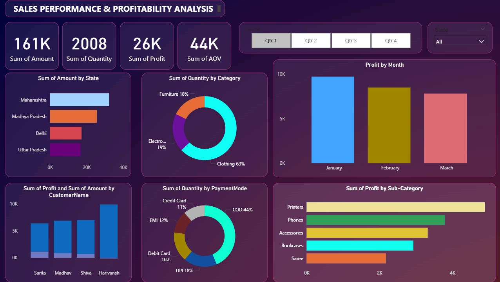

# 📈 Sales Performance & Profitability Analysis

## 🎯 Project Overview
This project focuses on moving beyond standard sales reporting to perform a structured **Profitability Analysis** using Power BI.

The primary objective was to evaluate:

- Sales performance across categories
- Margin-driving products
- Customer purchasing patterns
- Regional business trends
- Payment behavior insights

---

## 💡 Key Business Insights

Key findings derived from the dashboard:

✔ **Category Dominance:** Clothing contributes **63% of total quantities sold**, establishing it as the primary volume driver.

✔ **Profit Drivers:** Printers and Phones emerged as the leading profit-generating sub-categories despite comparatively lower sales volume.

✔ **Customer Payment Behavior:** **44% of customers prefer Cash on Delivery (COD)**, significantly exceeding UPI (18%) and Credit Cards (11%).

✔ **Regional Performance:** Maharashtra leads in total sales amount, followed by Madhya Pradesh and Delhi.

✔ **Customer Profitability:** Harivansh was identified as the most profitable customer, indicating value concentration within specific high-spend accounts.

---

## 🖼️ Dashboard Preview

---

## 🛠️ Technical Implementation

- **Power BI Desktop** → Data transformation, modeling, and DAX calculations  
- **Power Query** → ETL & data shaping  
- **DAX** → KPI & metric calculations  
- **Data Visualization** → Composition & performance analysis visuals  
- **GitHub** → Documentation & version control  

---

## 🧠 Skills Demonstrated

- Business Intelligence Reporting
- Profitability Analysis
- KPI Design
- Analytical Thinking
- Insight Communication
- Dashboard Design

---

*Developed as part of my Power BI analytics portfolio.*
